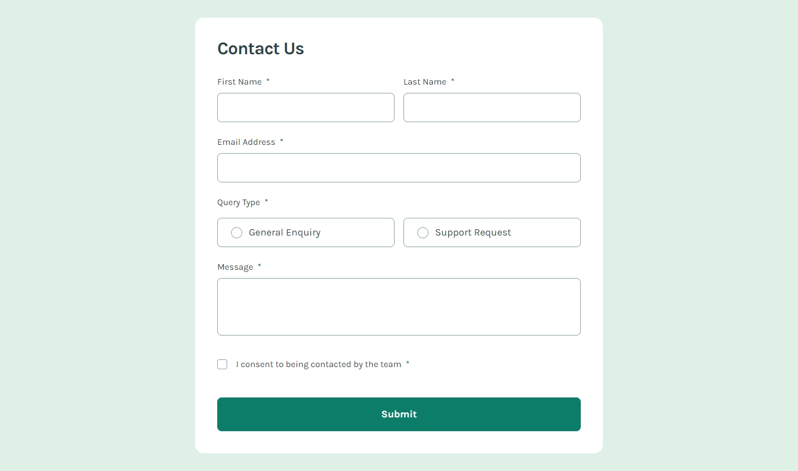
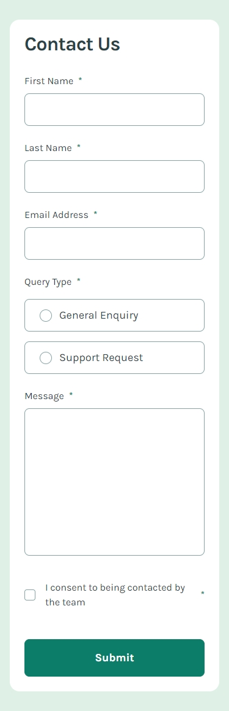
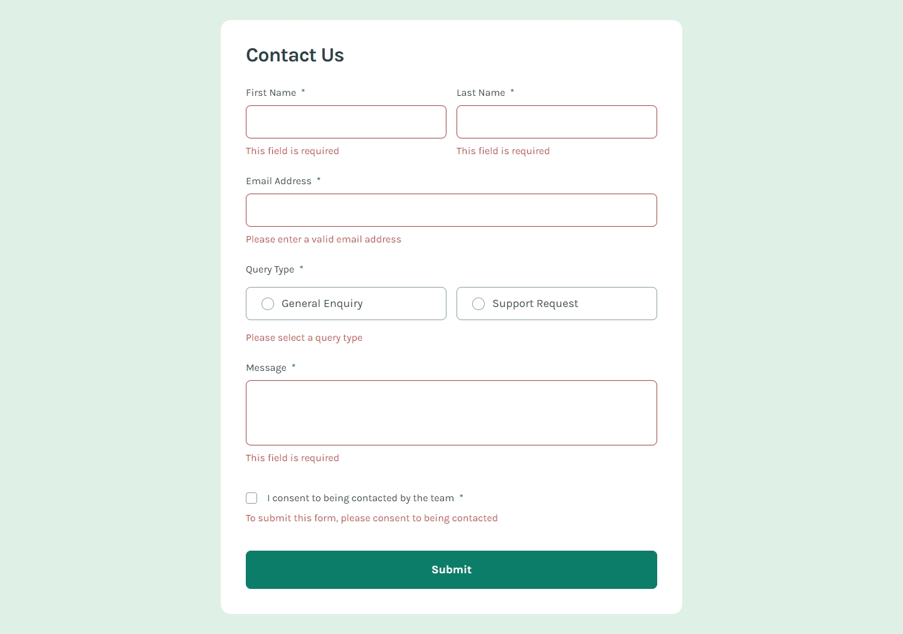

## Frontend Mentor Challenge 21 - Contact Form

This is my solution to the [Contact Form](https://www.frontendmentor.io/challenges/contact-form--G-hYlqKJj) challenge on [Frontend Mentor](https://www.frontendmentor.io/).

#

### Links. 🔗

- Live Site URL: https://contact-form-darkstarxdd.vercel.app/

#

### Screenshots of the Solution (Desktop, Mobile & Error States). 🔍

#

### Built with. 🔨

- React.
- Vanilla CSS (Using CSS Modules).
- Zod - Form validation.
- Vite.

#

### Features. ✨

- Form validation using Zod, with error checking triggered on form submission.
- Form is fully keyboard accessible and inputs and error messages are properly announced to screen readers.

#

### New Things Learned. 🎓

- React’s context API and the compound component pattern.

#

### Testing and Accessibility. 🧪

- Tested site usability with keyboard-only navigation.
- Used the Responsively App to check the site's appearance on various screen sizes, from 320x480 to 3000x2000.
- Set the browser font size on desktop to various values ranging from 9px to 72px to make sure everything on the site scales properly with the user's preferred browser font size.
- Zoomed the page in and out using Ctrl + Scroll wheel (up to 500%).
- Tested with the NVDA screen reader.
- Viewed the site on an iPhone 11 in both portrait and landscape modes.
- Performed Lighthouse and PageSpeed tests. ([PageSpeed Result.](https://pagespeed.web.dev/analysis/https-contact-form-darkstarxdd-vercel-app/x5aum0xnla?form_factor=mobile))

#

### Tools I Use. 🔧

- [Prettier VS Code Extension](https://marketplace.visualstudio.com/items?itemName=esbenp.prettier-vscode) - Code formatter.

- [Responsively.app](https://responsively.app/) - A free and open source tool that allows you to test your webpage on different screen sizes, take screenshots and much more.

- [Google Webfonts Helper by Mario Ranftl](https://gwfh.mranftl.com/fonts) - Provides WOFF2 format for Google Fonts.

- [Color Contrast Checker by coolors.co](https://coolors.co/contrast-checker/112a46-acc8e5) - Check color contrast ratios and if needed, update the colors to match the WCAG guidelines.

#

- My Frontend Mentor Profile - [@DarkstarXDD](https://www.frontendmentor.io/profile/DarkstarXDD)
